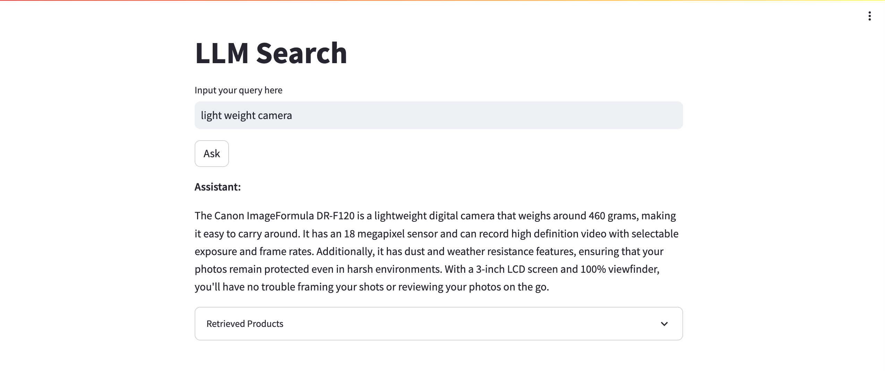

# Product Search with LangChain and Llama2

## Overview
This project leverages Langchain, (quantized) open-source Llama2 and retrieval-augmented generation (RAG) to perform product similarity search on a single T4 GPU.

## Method
- **Model:** Meta's LLama2 on HuggingFace, 4-bit quantization and LoRA 
- **Data:** [WDC Product Dataset](https://huggingface.co/datasets/wdc/products-2017)
- **Framework:** [Langchain](https://python.langchain.com/docs/get_started/introduction.html)
- **Embedding:** [Instruction fine-tuned text embedding](https://huggingface.co/hkunlp/instructor-large), [VectorDB](https://python.langchain.com/docs/integrations/vectorstores/chroma)

The whole process is demonstrated in the repo's jupyter notebook.

## Working App
The working app was built using Streamlit.

Upon launching, it takes about a minute for the app to load the dependencies.

Once all are succesfully loaded, this is the interface of the app:

Type the query in the query box:

The app will search and return an answer to the user question:

For reference, the expander contains the retrieved products (with the metadata):

